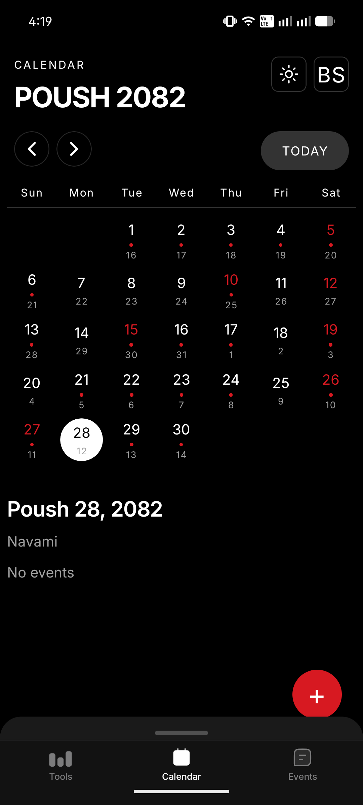
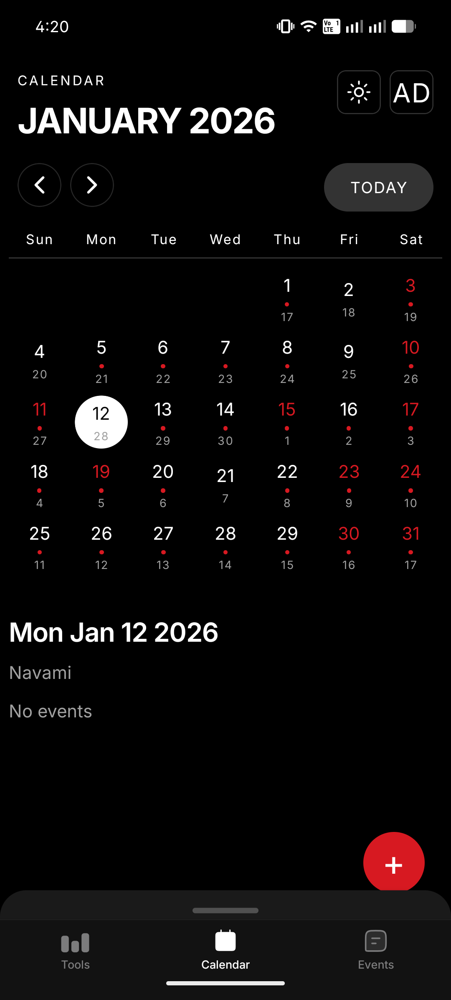
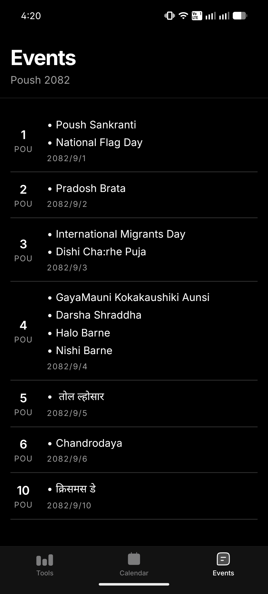
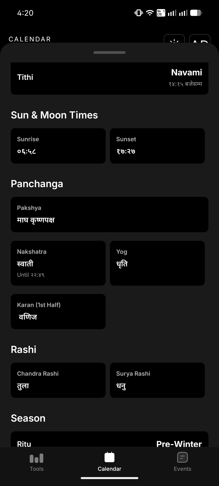
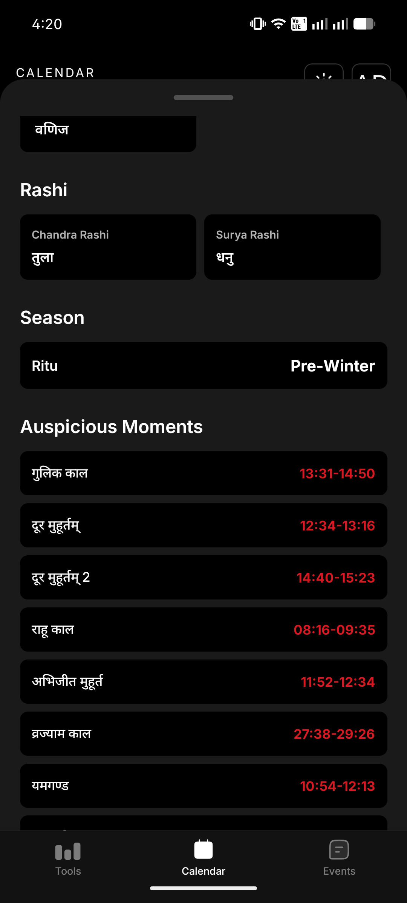

# TithiMiti

A modern Nepali calendar application designed to bridge cultural traditions with contemporary mobile technology. TithiMiti provides seamless conversion between Bikram Sambat and Gregorian calendars while offering comprehensive lunar calendar information, festival tracking, and essential tools for daily use.

<p align="center">
  
</p>

## Overview

TithiMiti serves the Nepali-speaking community worldwide by providing an intuitive interface to access traditional calendar systems alongside modern date management. The application combines the Bikram Sambat calendar system with the Gregorian calendar, offering users the ability to track festivals, tithis (lunar days), and auspicious times while managing personal events.

## Core Features

### Dual Calendar System

TithiMiti supports seamless switching between Bikram Sambat (BS) and Gregorian (AD) calendar views, allowing users to navigate dates in their preferred system while maintaining awareness of both.

**Bikram Sambat Calendar View**



The Bikram Sambat view displays dates in the traditional Nepali calendar format, showing both BS and AD dates for each day. Users can easily identify holidays, festivals, and special occasions marked directly on the calendar grid.

**Gregorian Calendar View**



The AD calendar view provides a familiar interface while maintaining connections to Nepali cultural dates, displaying the corresponding Bikram Sambat date for each Gregorian date.

### Comprehensive Event Management

Track both traditional festivals and personal events with an intuitive event management system.

**Monthly Event Overview**



View all events, holidays, and festivals for any given month at a glance. The application aggregates data from the Nepali calendar API to display traditional festivals alongside your custom events.

**Personal Event Creation**


Create and manage personal events with support for both BS and AD date entry. Events are stored locally and sync across your calendar views.

### Detailed Day Information

Access comprehensive panchanga (almanac) information for any selected day.

**Tithi and Panchanga Details**



Each day displays detailed information including:
- Tithi (lunar day) with precise ending time
- Pakshya (lunar fortnight)
- Nakshatra (lunar mansion) with transition time
- Yoga (lunisolar day)
- Karana (half-tithi)
- Rashi (moon sign and sun sign)
- Ritu (season)

**Sunrise, Sunset, and Auspicious Times**



Additional information includes:
- Sunrise and sunset times
- Moonrise and moonset times
- Auspicious moments (Shubha Muhurat) for important activities
- Multiple calendar era display (Nepal Sambat, Saka Sambat)

### Utility Tools

The converter screen provides essential tools for daily use.


**Date Conversion**
Convert dates between Bikram Sambat and Gregorian calendars instantly. Enter a date in one format and receive the corresponding date in the other system.

**Gold and Silver Prices**
Real-time gold and silver prices in Nepali currency (per tola), fetched from reliable sources and cached for offline access.

**Daily Horoscope**
Vedic astrology-based daily horoscope readings for all twelve zodiac signs (rashis), generated using traditional calculation methods and enhanced with AI-powered insights.

## Technical Architecture

### Technology Stack

- **Framework**: React Native with Expo SDK 54
- **Navigation**: Expo Router with file-based routing
- **State Management**: React Context API
- **Storage**: AsyncStorage for persistent data
- **Animations**: Reanimated 4 for smooth transitions
- **Gestures**: React Native Gesture Handler
- **Notifications**: Expo Notifications for event reminders
- **HTTP Client**: Axios for API communication

### Data Sources

- **Calendar API**: Integration with Bikram Sambat calendar data from `data.miti.bikram.io`
- **Metal Prices**: Live market data from HamroPatro API
- **Horoscope**: Vedic calculations with AI-enhanced interpretations
- **Festivals**: Comprehensive database of Nepali festivals and holidays

### Architecture Highlights

The application follows a modular architecture with clear separation of concerns:

- **Domain Layer**: Calendar conversion logic, type definitions
- **Service Layer**: API clients, caching mechanisms, notification handlers
- **UI Layer**: Reusable components following Nothing OS design principles
- **State Layer**: Centralized application state management

## Use Cases

### Why Choose TithiMiti Over Generic Calendar Apps?

**Cultural Relevance**

Generic calendar applications lack support for the Bikram Sambat calendar system used officially in Nepal. TithiMiti provides native BS calendar support, making it the natural choice for anyone needing to track dates in the Nepali calendar system.

**Panchanga Information**

Traditional calendar apps do not provide panchanga details essential for religious and cultural observances. TithiMiti includes tithi, nakshatra, yoga, karana, and auspicious timing information crucial for planning ceremonies, festivals, and important life events.

**Festival Awareness**

While other apps may add Nepali festivals as external imports, TithiMiti has festivals integrated into its core calendar data, ensuring accuracy and cultural appropriateness. Users never miss important cultural celebrations and observances.

**Dual Calendar Navigation**

Users who work with both calendar systems benefit from instant conversion and simultaneous display. This is particularly valuable for:
- Government employees who use BS for official work
- Individuals planning international travel
- Businesses operating across Nepal and other countries
- Students and researchers studying calendar systems

**Offline Capability**

Calendar data and conversion logic work offline after initial data fetch, making TithiMiti reliable in areas with limited connectivity. This is essential for users in remote regions or during travel.

**Privacy First**

All personal events are stored locally on the device. No user data is transmitted to external servers, ensuring complete privacy and data sovereignty.

## Installation

### Prerequisites

- Node.js 18 or higher
- npm or yarn package manager
- Android Studio (for Android development)
- Expo CLI

### Development Setup

1. Clone the repository:
```bash
git clone https://github.com/ByapakSigdel/TithiMiti.git
cd tithi-miti
```

2. Install dependencies:
```bash
npm install
```

3. Start the development server:
```bash
npx expo start
```

4. Run on a device or emulator:
- Press `a` for Android
- Press `i` for iOS
- Scan the QR code with Expo Go app

### Building for Production

**Android APK:**
```bash
npx eas-cli build --platform android --profile preview
```

**Android App Bundle (for Play Store):**
```bash
npx eas-cli build --platform android --profile production
```

## Project Structure

```
tithi-miti/
├── app/                          # Application screens and routing
│   ├── (tabs)/                   # Tab-based navigation
│   │   ├── index.tsx            # Calendar screen
│   │   ├── events.tsx           # Events overview
│   │   └── converter.tsx        # Date converter (moved to root)
│   ├── _layout.tsx              # Root layout with providers
│   ├── converter.tsx            # Tools and utilities
│   └── modal.tsx                # Add event modal
├── src/
│   ├── components/              # Reusable UI components
│   │   ├── calendar/            # Calendar-specific components
│   │   └── events/              # Event management components
│   ├── domain/                  # Business logic
│   │   └── calendar/            # Calendar conversion and types
│   ├── services/                # External integrations
│   │   ├── api/                 # API clients
│   │   ├── cache/               # Caching layer
│   │   ├── events/              # Event storage
│   │   ├── horoscope/           # Horoscope generation
│   │   └── notifications/       # Notification handling
│   ├── state/                   # Global state management
│   ├── ui/                      # Design system components
│   │   ├── core/                # Base components
│   │   └── theme/               # Theme definitions
│   └── utils/                   # Utility functions
├── assets/                      # Static resources
│   └── images/                  # Application images
└── plugins/                     # Expo config plugins
```

## Contributing

We welcome contributions from the community to make TithiMiti even better. Whether you are fixing bugs, adding features, or improving documentation, your help is appreciated.

### How to Contribute

1. **Fork the Repository**
   
   Click the 'Fork' button at the top right of the repository page to create your own copy.

2. **Create a Feature Branch**
   
   ```bash
   git checkout -b feature/your-feature-name
   ```
   
   Use descriptive branch names:
   - `feature/` for new features
   - `fix/` for bug fixes
   - `docs/` for documentation updates
   - `refactor/` for code improvements

3. **Make Your Changes**
   
   - Write clear, concise commit messages
   - Follow the existing code style and conventions
   - Add comments for complex logic
   - Update documentation as needed

4. **Test Your Changes**
   
   - Ensure the app runs without errors
   - Test on both Android and iOS if possible
   - Verify calendar conversions are accurate
   - Check that UI remains responsive

5. **Submit a Pull Request**
   
   - Push your changes to your fork
   - Create a pull request against the main branch
   - Provide a clear description of your changes
   - Reference any related issues

### Development Guidelines

**Code Style**

- Use TypeScript for type safety
- Follow React hooks best practices
- Keep components small and focused
- Use functional components over class components
- Implement proper error handling

**Commit Messages**

Follow the conventional commits format:
```
type(scope): description

[optional body]
[optional footer]
```

Examples:
- `feat(calendar): add Nepal Sambat support`
- `fix(conversion): correct leap year calculation`
- `docs(readme): update installation instructions`

**Testing**

- Test calendar conversions thoroughly
- Verify UI across different screen sizes
- Check performance with large datasets
- Ensure offline functionality works correctly

### Areas for Contribution

**High Priority**

- iOS support and testing
- Additional language support (Nepali Unicode)
- Widget functionality (currently disabled)
- Performance optimizations
- Accessibility improvements

**Feature Requests**

- Integration with other Nepali calendar APIs
- Export/import event data
- Recurring event support
- Custom holiday definitions
- Dark/light theme refinements

**Documentation**

- API documentation
- Component documentation
- User guide in Nepali
- Video tutorials
- Architecture decision records

### Reporting Issues

When reporting bugs or requesting features, please include:

- Clear description of the issue
- Steps to reproduce (for bugs)
- Expected vs actual behavior
- Screenshots if applicable
- Device and OS information
- App version

## License

This project is licensed under the MIT License - see the [LICENSE](LICENSE) file for details.

Copyright (c) 2026 Byapak Sigdel

## Contact

For questions, suggestions, or collaboration opportunities:
- Email: [sigdelmb123@gmail.com]

---

Built with care for the Nepali-speaking community worldwide.


